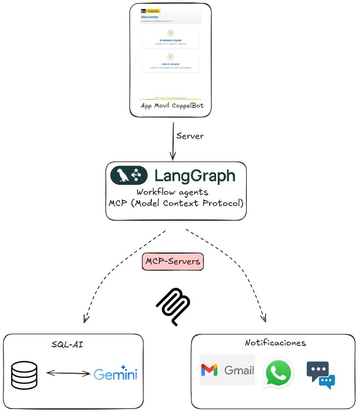
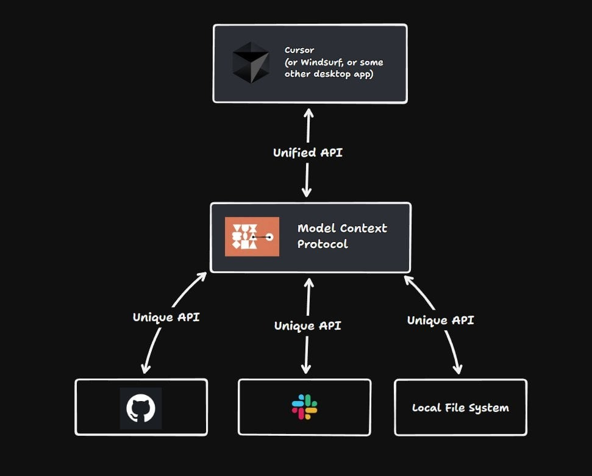
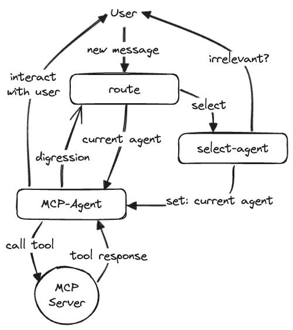
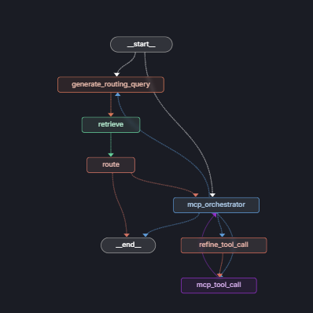
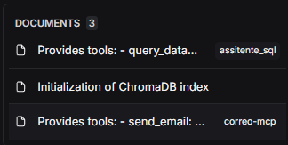
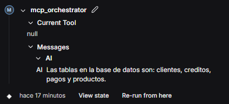

# readme

# 📱 CoppelBot – Asistente Digital para Coppel

**CoppelBot** es una **aplicación móvil multiplataforma**, desarrollada inicialmente en HTML, CSS y JavaScript, y empaquetada como una app móvil funcional. Está diseñada para **mejorar la experiencia de empleados, microempresarios y administradores** dentro del ecosistema de Coppel, facilitando el acceso a herramientas clave desde sus dispositivos móviles.

## 🧠 ¿Qué es CoppelBot?

CoppelBot es una **app móvil de navegación por perfiles**, pensada para ser una solución ágil y visualmente amigable dentro de los procesos internos de Coppel. Se estructura en tres vistas independientes según el tipo de usuario, cada una adaptada a sus necesidades específicas.

Aunque parte de una base web, ha sido construida con la intención de ser ejecutada como **aplicación nativa en celulares**, lo que permite una experiencia optimizada sin necesidad de conexión constante a internet.

Tecnologías utilizadas:

> • LangGraph: Framework de orquestación de agentes de IA, utilizado como núcleo del sistema Coppel-Bot. Nos permite construir flujos de trabajo complejos mediante grafos, donde cada nodo representa un agente con una función específica. Esta estructura facilita la interacción entre agentes, el control del estado de las conversaciones, y la ejecución de tareas de forma contextual y escalable.
> 

> • Model Context Protocol (MCP): Protocolo que estandariza la comunicación entre modelos de lenguaje y servicios externos. En Coppel-Bot, lo utilizamos para conectar a los agentes con distintos servidores personalizados:
> 

> • Un servidor de consultas MySQL, que responde preguntas sobre datos reales de la base de datos de Coppel.
> 
> - Un servidor de notificaciones, que permite enviar alertas automatizadas a los microempresarios.
> - Un servidor de análisis, encargado de generar visualizaciones gráficas a partir de los datos consultados.
> - SQLAlchemy: ORM de Python para interactuar con bases de datos SQL de forma flexible y eficiente.
> - Gemini AI (Google): Modelo de inteligencia artificial avanzado desarrollado por Google, con capacidad de entender y generar lenguaje natural de manera precisa. En Coppel-Bot, cumple un rol fundamental:
> - Comprende las preguntas del colaborador en lenguaje natural.
> - Colabora con los agentes del sistema para traducirlas en consultas SQL válidas.
> - Aporta criterio contextual y multimodal en la toma de decisiones conversacionales.
> - WebkitSpeechRecognition: API de reconocimiento de voz integrada en navegadores como Chrome. Se utiliza para transcribir en tiempo real las consultas verbales del colaborador, permitiendo una experiencia de uso fluida y sin necesidad de entrada manual.
> - Offline-first: Operatividad sin conexión con sincronización automática.
> - Smtplib: Módulo de Python utilizado para enviar correos electrónicos mediante el protocolo SMTP. En nuestro sistema, automatiza el envío de notificaciones a los microempresarios, manteniéndolos informados sobre avances en sus cursos, nuevas actividades, o cualquier evento importante relacionado con su cuenta.
> - Web scraping: Implementado para identificar negocios cercanos a las rutas establecidas de los colaboradores, con base en su ubicación y características específicas.

## 🚀 ¿Cómo Funciona?

1. El usuario abre la app y visualiza la pantalla de inicio (archivo index.html).
2. Se le solicita elegir su perfil:
    - **Empleado** → Accede a nómina, desempeño y tickets.
    - **Microempresario** → Gestiona ventas, inventario y clientes.
    - **Administrador** → Visualiza estadísticas, usuarios y gestiona el sistema.
3. Dependiendo del perfil, se abre una interfaz personalizada.
4. Toda la navegación está construida con botones gráficos e íconos intuitivos.
5. La app puede ejecutarse directamente en el navegador o ser empaquetada con tecnologías como **Capacitor o Cordova** para convertirla en una aplicación móvil.

# Como funcionan los agentes de Coppel-Bot

Como hemos mencionado, es gracias a nuestros agentes de Langgraph han hecho posible manejar todo el sistema coppelBot. Por su flujo de trabajo y conjunto de varias herramientas, y por su capacidad de mantener en gran memoria su conversación. En esta parte explicaremos el flujo de nuestro sistema, con ayuda del IDE de Langgraph, Langgraph Studio.

GRAFO

Este es el grafo que define el flujo interno que tiene nuestro sistema de agentes.

Inicia en el nodo **GENERATE_ROUTING_QUERY,** este nodo se encarga de en el primer caso, enviar la consulta del usuario al nodo retrieve, mas adelante ese mismo nodo funciona como complemento del mcp_orquestador para mas tarde.

Continua en el nodo

**RETRIEVE**

que su función es recuperar las herramientas ofrecidas por los servidores MCP, que en nuestro caso son execute_query, para la base de datos, y send para las notificaciones, estas herramientas se encuentran almacenadas en una Base de Datos de Vectores, para que el sistema pueda acceder a la esperada en cualquier momento

Seguimos con el nodo

**ROUTE,**

encargado de delegar la petición del usuario, es decir, si la consulta del usuario se resuelve gracias a las herramientas de los servidores MCP, la enviara al nodo mcp_orchestador, pero si en caso contrario no se resuelve, se enviara directo al fin, con un mensaje de “No se encuentra herramienta MCP para la consulta”

Si la consulta es apta para un servidor MCP, el nodo ROUTE la envía al nodo **MCP_ORCHESTRATOR**. Este nodo es el corazón de la interacción con el servidor MCP seleccionado. Su función principal es coordinar el uso de las herramientas dentro del servidor elegido:

1. Identifica el servidor (current_mcp_server) que el nodo ROUTE eligió.
2. Se comunica con ese servidor MCP específico para obtener la lista detallada de herramientas que este ofrece (como execute_query o send_email, junto con sus descripciones y parámetros necesarios).
3. Utiliza un modelo de lenguaje (LLM) configurado con un *prompt* específico (mcp_orchestrator_system_prompt) que le instruye sobre cómo usar las herramientas disponibles, priorizando la búsqueda de información en bases de datos antes de preguntar al usuario y considerando otros servidores disponibles.
4. El LLM, analizando el historial de la conversación (messages) y las herramientas disponibles del servidor, decide el siguiente paso:
    - Si puede responder directamente al usuario, genera una respuesta en texto.
    - Si necesita usar una herramienta específica del servidor MCP, genera una 'llamada a herramienta' (tool_call), indicando qué herramienta usar y con qué argumentos.
    - Si determina que las herramientas actuales no son suficientes (IDK_RESPONSE) o que otro servidor sería más adecuado (OTHER_SERVERS_MORE_RELEVANT), puede indicarlo para redirigir el flujo o finalizar.
5. Toma la llamada a herramienta (tool_call) inicial propuesta por el mcp_orchestrator.
6. Utiliza otro LLM (tool_refiner_model) con un *prompt* (tool_refiner_prompt) enfocado específicamente en extraer y formatear correctamente los *argumentos* necesarios para esa herramienta.
7. Revisa el historial completo de la conversación (messages) y la definición detallada de la herramienta (tool_info) para asegurarse de que todos los parámetros se completen de la mejor manera posible, incluso si la información relevante no estaba en el último mensaje.
8. Genera una nueva llamada a herramienta (tool_call) con los argumentos ya refinados y listos para la ejecución.

Finalmente, la llamada a herramienta (ya sea directa desde mcp_orchestrator o refinada por refine_tool_call) llega al nodo **MCP_TOOL_CALL**. Este nodo es el ejecutor:

1. Extrae el nombre de la herramienta y sus argumentos finales del último mensaje (AIMessage con tool_calls).
2. Se comunica directamente con el servidor MCP (current_mcp_server) correspondiente.
3. Invoca la función mcp.RunTool en el servidor MCP, pasándole el nombre y los argumentos de la herramienta. Es aquí donde la acción real (como ejecutar una consulta SQL o enviar una notificación) sucede en el sistema externo representado por el servidor MCP.
4. Recibe el resultado (o un error) de la ejecución de la herramienta desde el servidor MCP.
5. Empaqueta este resultado en un mensaje especial (ToolMessage) y lo añade al estado de la conversación.
6. el MCP_ORCHESTRATOR decide que necesita usar una herramienta, el flujo puede pasar (especialmente para herramientas más complejas como las de OpenAPI) por el nodo **REFINE_TOOL_CALL**. La función de este nodo es mejorar la calidad de los argumentos antes de ejecutar la herramienta:
    
    
    

Tras la ejecución en MCP_TOOL_CALL, el flujo generalmente regresa al nodo MCP_ORCHESTRATOR. Con el resultado de la herramienta (ToolMessage) ahora en el historial, el orquestador puede evaluar si la tarea está completa, si necesita usar otra herramienta, o si debe generar una respuesta final para el usuario. Este ciclo permite al agente realizar tareas complejas que requieren múltiples pasos o interacciones con herramientas externas.

# 

## 🗂 ¿Qué Contiene el Repositorio?

📁 CoppelBot/

├── index.html → Pantalla principal de selección de perfil

├── empleado.html → Vista de usuario Empleado

├── microempresario.html → Vista de usuario Microempresario

├── administrador.html → Vista de usuario Administrador

├── css/ → Estilos visuales personalizados

├── js/ → Scripts de interacción básica

├── icons/ → Íconos SVG utilizados en la interfaz

├── manifest.json → Configuración para PWA (app móvil)

└── LICENSE → Licencia de uso (MIT)

## ▶️ ¿Cómo Ejecutarla?

### 🖥 Versión Web (para pruebas):

1. Clona el repositorio:
2. git clone https://github.com/dragon88888888888/CoppelBot.git
3. cd CoppelBot
4. Abre index.html con cualquier navegador moderno.

### 📱 Versión Móvil (final):

- El código puede integrarse con herramientas como **Capacitor**, **Cordova** o **Flutter WebView** para convertirlo en app.
- El archivo manifest.json permite instalar la app como **PWA** directamente desde el navegador en Android.

## ⚖️ Licencia

Copyright (c) [2025] [ROBIK AI]

Todos los derechos reservados.

Este software y su documentación son propiedad de [ROBIK AI] y están protegidos por las leyes de derechos de autor. Queda prohibido:

- Distribuir este código sin permiso explícito.
- Modificar, sublicenciar o vender este código.
- Usar este código en proyectos comerciales sin autorización.

Para solicitar permisos adicionales, contacta a [scribd3456@gmail.com].

## 🧑‍💼 Proyecto Desarrollado para:

**Coppel** – Soluciones digitales internas

Autor: **Jesús Martínez**

Año: **2025**